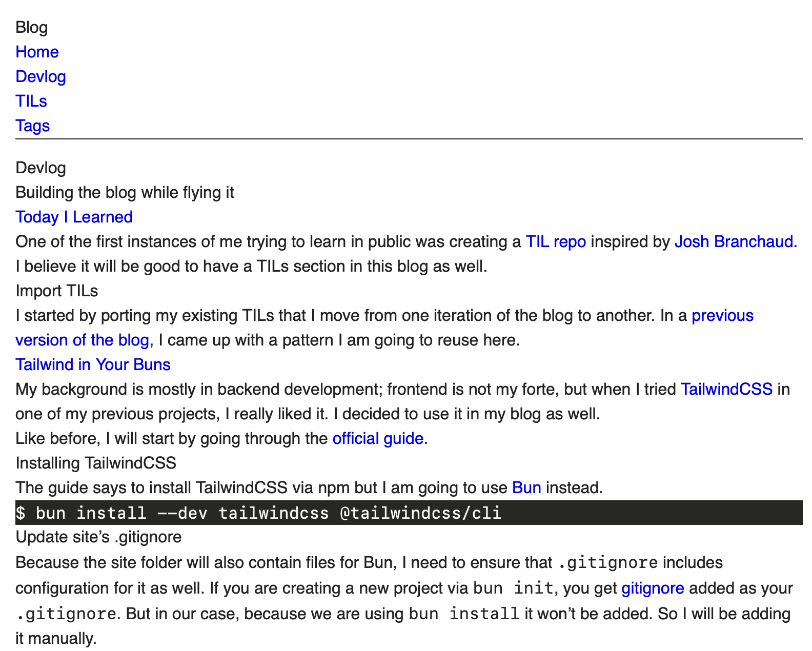
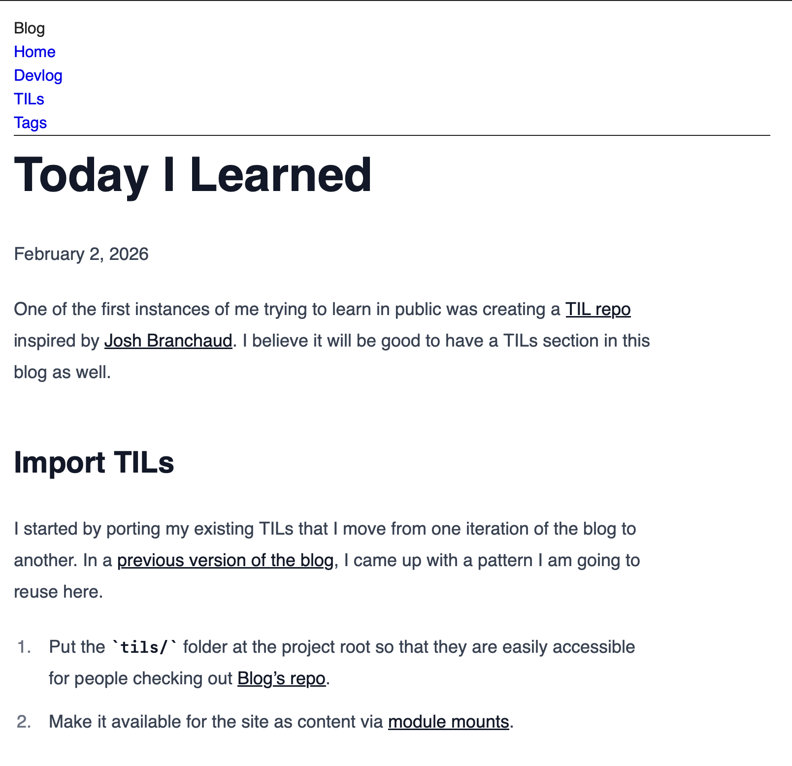

When I [added Tailwind CSS with the Typography plugin](/devlog/tailwind-in-your-buns/) to this blog, I actually did not add any styles. Not because I forgot; I just decided to do it later. Due to [tailwind's preflight](https://tailwindcss.com/docs/preflight) almost all default styling is removed.



## Add scripts entries for new devlogs

Before I start fixing styles as a quality of life improvement, I will add a couple of `scripts` commands in `package.json`.

```diff
diff --git a/site/package.json b/site/package.json
index dceb6be..e9af61c 100644
--- a/site/package.json
+++ b/site/package.json
@@ -1,5 +1,8 @@
 {
   "scripts": {
+    "server": "hugo server -D",
+    "content:devlog": "sh -c 'hugo new content --kind devlog devlog/$1.md' --",
+    "content:devlog-bundle": "sh -c 'hugo new content --kind devlog-bundle devlog/$1/index.md' --",
     "content:til": "sh -c 'hugo new content --kind til ../../tils/$1' --"
   },
   "dependencies": {},
```

I believe the only one that needs additional explanation is `content:devlog-bundle. Some of Devlog's entries will have images and maybe some other media; in these cases I want to use [page bundles](https://gohugo.io/content-management/page-bundles/) instead of normal pages.

## Design that responds

TailwindCSS uses [a mobile-first approach](https://tailwindcss.com/docs/responsive-design#overview), so we need to make sure we have our viewport configured correctly.

```diff
diff --git a/theme/layouts/_partials/head.html b/theme/layouts/_partials/head.html
index 13f1cd6..7e424cf 100644
--- a/theme/layouts/_partials/head.html
+++ b/theme/layouts/_partials/head.html
@@ -1,5 +1,5 @@
 <meta charset="utf-8">
-<meta name="viewport" content="width=device-width">
+<meta name="viewport" content="width=device-width, initial-scale=1.0" />
 <title>{{ if .IsHome }}{{ site.Title }}{{ else }}{{ printf "%s | %s" .Title site.Title }}{{ end }}</title>
 {{ with (templates.Defer (dict "key" "global")) }}
   {{ partial "head/css.html" . }}
```
## Replace theme CSS with TailwindCSS's utility classes

Hugo's theme skeleton comes with basic styles:

```css
body {
  color: #222;
  font-family: sans-serif;
  line-height: 1.5;
  margin: 1rem;
  max-width: 768px;
}

header {
  border-bottom: 1px solid #222;
  margin-bottom: 1rem;
}

footer {
  border-top: 1px solid #222;
  margin-top: 1rem;
}

a {
  color: #00e;
  text-decoration: none;
}
```

I would like to replace them one-to-one with TailwindCSS's utility classes mostly for practice, because I am planning to update the theme almost right away with the ones that come from the [typography plugin](https://github.com/tailwindlabs/tailwindcss-typography).

Most of these styles we can just replace with existing classes with 3 exceptions:

1. The theme uses two base colors, `#222` for text and `#00e` for hyperlinks. TailwindCSS does not have these colors in it's [color pallete](https://tailwindcss.com/docs/colors). I will be adding them as `@theme`'s [custom colors](https://tailwindcss.com/docs/colors#customizing-your-colors).
1. Hugo's theme also sets `font-family: sans-serif`, which does not match default fonts, so I need to add a [custom font as well](https://tailwindcss.com/docs/font-family#customizing-your-theme).
1. The theme disables `a` tag underlining with `text-decoration: none;`, preflight does this [out of the box](https://github.com/tailwindlabs/tailwindcss/blob/main/packages/tailwindcss/preflight.css#L87), so we do not need to port this.
1. Preflight also [sets the default font to sans](https://github.com/tailwindlabs/tailwindcss/blob/1b16411919457ee47d38910fd07e134e9765eb4c/packages/tailwindcss/preflight.css#L33C3-L33C14), which means we can skip porting it as well.
1. To apply styles to all `a` tags, we need to [update base layer styles](https://tailwindcss.com/docs/preflight#extending-preflight).

Our `theme/assets/css/main.css` now looks like this:

```css
@import "tailwindcss";
@source "hugo_stats.json";
@plugin "@tailwindcss/typography";

@theme {
  --color-body: #222;
  --color-links: #00e;
}

@layer base {
  a {
    @apply text-links;
  }
}
```

And this is how `theme/layouts/baseof.html` is changed:

```diff
diff --git a/theme/layouts/baseof.html b/theme/layouts/baseof.html
index 39dcbec..a42c5a9 100644
--- a/theme/layouts/baseof.html
+++ b/theme/layouts/baseof.html
@@ -3,14 +3,14 @@
 <head>
   {{ partial "head.html" . }}
 </head>
-<body>
-  <header>
+<body class="text-body leading-normal m-4 max-w-3xl">
+  <header class="border-b-1 border-solid mb-4 border-color-body">
     {{ partial "header.html" . }}
   </header>
   <main>
     {{ block "main" . }}{{ end }}
   </main>
-  <footer>
+  <footer class="border-t-1 border-solid mt-4 border-color-body">
     {{ partial "footer.html" . }}
   </footer>
 </body>
```

The `leading-normal` comes from [`default-theme.ts`](https://github.com/tailwindlabs/tailwindcss/blob/main/packages/tailwindcss/src/compat/default-theme.ts#L671), but all other classes can be found in the documentation. The number `4` in margin classes denotes `1rem`, because it is multiplicative of the [default theme variable `--spacing`](https://tailwindcss.com/docs/theme#:~:text=%2D%2Dspacing:%200.25rem;)

## Let your writing become `prose`

Next, I wrapped content in `theme/layouts/page.html` with `article` tag and enabled [tailwindcss-typography](https://github.com/tailwindlabs/tailwindcss-typography)'s styles by adding `prose` classes.

`prose` is configured to look good for screens of all sizes out of the box

> Everything about the provided size modifiers has been hand-tuned by professional designers to look as beautiful as possible, including the relationships between font sizes, heading spacing, code block padding, and more.

Still, I feel it looks too small on larger screens, so I will be adding `lg` breakpoint config as well.

```diff
diff --git a/theme/layouts/page.html b/theme/layouts/page.html
index 7e286c8..efa41c7 100644
--- a/theme/layouts/page.html
+++ b/theme/layouts/page.html
@@ -1,4 +1,5 @@
 {{ define "main" }}
+  <article class="prose lg:prose-lg">
     <h1>{{ .Title }}</h1>

     {{ $dateMachine := .Date | time.Format "2006-01-02T15:04:05-07:00" }}
@@ -7,4 +8,5 @@

     {{ .Content }}
     {{ partial "terms.html" (dict "taxonomy" "tags" "page" .) }}
+  </article>
 {{ end }}
```

Note: diff is shown here with the `--ignore-space-change` param to skip highlighting whitespace-only changes. 



Already looks so much better, but now `prose` is applied, our default styles are ignored, that is mostly ok, but I want links to [use the theme's color](https://github.com/tailwindlabs/tailwindcss-typography?tab=readme-ov-file#adding-custom-color-themes).

```diff
diff --git a/theme/assets/css/main.css b/theme/assets/css/main.css
index 3f52090..69dfbbb 100644
--- a/theme/assets/css/main.css
+++ b/theme/assets/css/main.css
@@ -13,3 +13,7 @@
     @apply text-links;
   }
 }
+
+@utility prose-theme {
+  --tw-prose-links: var(--color-links);
+}
```

Add `prose-theme` next to `prose`, and do the same for `theme/layouts/tils/page.html`.

## "Centering the div"

For centering container, tailwind has [`mx-auto`](https://tailwindcss.com/docs/margin#:~:text=%3Cnumber%3E\);-,my%2Dauto,-margin%2Dblock:%20auto), but because we have `max-w-3xl` class on the `body` adding `mx-auto` to `article` tag doesn't actually put the content in the middle of the page.

In the [typography plugin docs](https://github.com/tailwindlabs/tailwindcss-typography?tab=readme-ov-file#overriding-max-width) it states:

> Each size modifier comes with a baked in max-width designed to keep the content as readable as possible. This isn't always what you want though, and sometimes you'll want the content to just fill the width of its container.

It actually sets `max-width: 65ch` which is roughly equivalent to 80 characters per line. This also means I can drop `max-w-3xl` class that came from the theme skeleton. Now the content is in the middle as we wanted.

## Before I go

There are a couple of list pages in our site and they all need better styling. I will update them later for now I just want to remove `.Summary` usage, because it has numerous different quirks[^1]. This means I can also drop [`<!--more-->`](https://gohugo.io/content-management/summaries/#manual-summary) 

[^1]: For example, it pulls headings from the article without the ability to shift them. This means all `h2` that fit into the summary's cut of will be shown as `h2`, which is weird because the default template for the home page uses `h2` for the page title in the listing. Here is another example that [I caught and reported](https://github.com/gohugoio/hugo/issues/14044)
