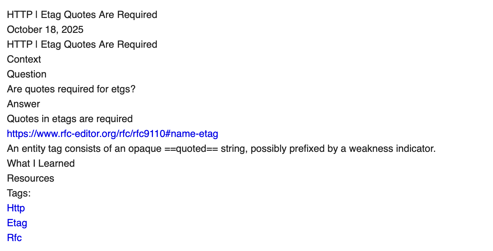

One of the first instances of me trying to learn in public was creating a [TIL repo](https://github.com/imomaliev/til) inspired by [Josh Branchaud](https://github.com/jbranchaud/til). I believe it will be good to have a TILs section in this blog as well.
## Import TILs

I started by porting my existing TILs that I move from one iteration of the blog to another. In a [previous version of the blog](https://github.com/imomaliev/blog-v3), I came up with a pattern I am going to reuse here.

1. Put the `tils/` folder at the project root so that they are easily accessible for people checking out [Blog's repo](https://github.com/imomaliev/blog).
1. Make it available for the site as content via [module mounts](https://gohugo.io/configuration/module/#mounts).

## TILs as content section

1. Add a `TILs` [section](https://gohugo.io/content-management/sections/).

    ```console
    $ touch theme/content/tils/_index.md
    ```
    Update the file.

    ```md
    ---
    title: "TILs"
    ---
    
    Today I Learned
    ```

1. Add link to the [menu](https://gohugo.io/content-management/menus/).

    ```diff
    diff --git a/theme/hugo.toml b/theme/hugo.toml
    index ea572d9..ae08c64 100644
    --- a/theme/hugo.toml
    +++ b/theme/hugo.toml
    @@ -9,10 +9,15 @@
         pageRef = '/devlog'
         weight = 20
     
    +  [[menus.main]]
    +    name = 'TILs'
    +    pageRef = '/tils'
    +    weight = 30
    +
       [[menus.main]]
         name = 'Tags'
         pageRef = '/tags'
    -    weight = 30
    +    weight = 40
     
     [module]
       [module.hugoVersion]
    ```
1. Mount the `tils/` folder as content.

    ```diff
    diff --git a/site/hugo.toml b/site/hugo.toml
    index 8e24de2..dab0932 100644
    --- a/site/hugo.toml
    +++ b/site/hugo.toml
    @@ -14,6 +14,15 @@ title = 'Blog'
         disableWatch = true
         source = 'hugo_stats.json'
         target = 'assets/notwatching/hugo_stats.json'
    +  # mount TILs as content
    +  [[module.mounts]]
    +    includeFiles = ['*-*.md']
    +    source = '../tils'
    +    target = 'content/tils'
    +  # restore default content mount
    +  [[module.mounts]]
    +    source = 'content'
    +    target = 'content'
     
     [build]
       [build.buildStats]
    ```

## TIL archetype

Many TIL repos do not have a given template, but I prefer a more structured approach. For now I will use my existing TIL template.

```md
{{- $pathParts := split .File.ContentBaseName "-" -}}
{{- $topic := index $pathParts 0 | title -}}
{{- $titleParts := $pathParts | after 1 -}}
{{- $question := delimit $titleParts " " | title -}}
{{- $title := printf "%s | %s" $topic $question -}}
---
title: "{{ $title }}"
date: {{ .Date }}
tags: [{{ lower $topic }}]
---

# {{ $title }}

## Context

## Question

## Answer

## What I Learned

## Resources
```

Hugo creates content relative to the `site/content` folder; this means we need to explicitly specify the `../../tils/` directory to reach the desired path. To create a new TIL we need to run this command:

```console
$ hugo new content --kind til ../../tils/{topic}-{title}.md
```

This is by no means perfect, and the template itself may look too verbose, but it will work for now.

## Custom TIL layout templates

Because I am making my TILs easily readable from the project's repo page apart from putting them at the root of the project, I've also added an h1 heading to the TIL archetype. But now they have two titles on a page.



To fix that, I will be adding a custom layout template for a single page. Also, I do not like having `.Summary` in the sections page, so I am going to update that as well.

1. Add `theme/layouts/tils/page.html`.

    ```html
    {{ define "main" }}
      <h1>{{ .Title }}</h1>

      {{ $dateMachine := .Date | time.Format "2006-01-02T15:04:05-07:00" }}
      {{ $dateHuman := .Date | time.Format ":date_long" }}
      <time datetime="{{ $dateMachine }}">{{ $dateHuman }}</time>

      {{- /* Do not render H1 from TIL */}}
      {{- replaceRE "(.*)<h1.*</h1>(.*)" "$1$2" .Content | safeHTML }}
      {{ partial "terms.html" (dict "taxonomy" "tags" "page" .) }}
    {{ end }}
    ```

1. Add `theme/layouts/tils/section.html`.

    ```html
    {{ define "main" }}
      <h1>{{ .Title }}</h1>
      {{ .Content }}
      {{ range .Pages }}
        <section>
          <h2><a href="{{ .RelPermalink }}">{{ .LinkTitle }}</a></h2>
        </section>
      {{ end }}
    {{ end }}
    ```

## Bun scripts command

Calling `hugo new content --kind til ../../tils/{topic}-{title}.md` each time I want to create a new TIL is a bit annoying; luckily for me, I can add a `scripts` entry to `site/package.json`

```diff
diff --git a/site/package.json b/site/package.json
index 3216302..dceb6be 100644
--- a/site/package.json
+++ b/site/package.json
@@ -1,4 +1,7 @@
 {
+  "scripts": {
+    "content:til": "sh -c 'hugo new content --kind til ../../tils/$1' --"
+  },
   "dependencies": {},
   "devDependencies": {
     "@tailwindcss/cli": "^4.1.18",
```

NOTE: We are using the `sh -c '' --` wrapper to pass the filename as a positional argument.

Now we can just do:

```console
# in site directory
$ bun content:til {topic}-{title}.md
```

Much better.

## Final touches

I do not like having my TILs listed on home page, let's [filter them out](https://gohugo.io/functions/collections/where/#string-comparison).

```diff
diff --git a/theme/layouts/home.html b/theme/layouts/home.html
index 0c76425..88b82ac 100644
--- a/theme/layouts/home.html
+++ b/theme/layouts/home.html
@@ -1,6 +1,6 @@
 {{ define "main" }}
   {{ .Content }}
-  {{ range site.RegularPages }}
+  {{ range where site.RegularPages "Section" "ne" "tils" }}
     <section>
       <h2><a href="{{ .RelPermalink }}">{{ .LinkTitle }}</a></h2>
       {{ .Summary }}
```
